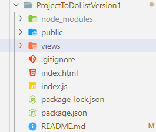

# Project To Do List Version1

Hi! I am Vishesh Saxena if you are seeking for To Do List project then you are at the right place here i built this to do list in a easy way so that it would be esay to understand the concept of To do Lidt login and this is a version one if we'll update the code we'll tell you

**Tech Stack :** Nodejs, Express.js, Javascript, Bootstrap, Html, Gitbash
**Editor :** VS-Code

## **Introduction**

A to-do list is a tool that helps you organize and manage tasks or items that you need to complete. It provides a simple way to track your progress, prioritize tasks, and ensure that nothing gets overlooked. A typical to-do list consists of a collection of items, each representing a task or activit

## **Code Snippet**

**Open VS Code.**

1. Open a new Terminal (open the path of your project folder or desktop or any folder).
2. Create a Folder `**mkdir ToDoList-v1`**
3. Go inside the folder `**cd ToDoList-v1/`**
4. 

**Now Downlod the files**

* public folder
* index.js file
* views folder

put in the folder and remove the other files **else** to create files or folders follow below

**Now using NPM download Node packages and modules follow the commonds**

1. npm init
2. npm i express ejs body-parser
3. npm i

a folder will be created
**SNAP SHOT**

this is the file and folder structure that will be formed
